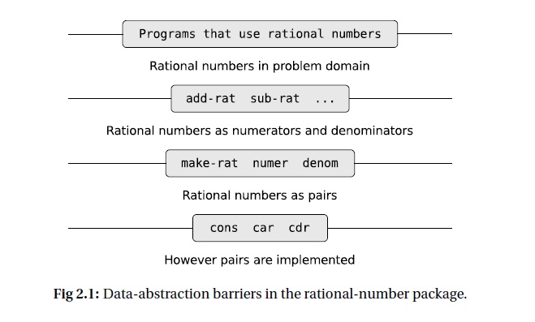

# SICP阅读时产生的疑问

最新在重看SICP，我想把面向对象语言里常用的一些概念和SICP里头的讲东西对应起来，但是遇到了特别多的问题，想向大家请教。

## 问题1
第一个问题是关于抽象屏障的，在SICP的第二章开头一节介绍了有理数的抽象：

如图所示：

如这张图所示构造函数，选择函数：make-rat number denom将有理数的使用方式和具体的实现分开了；
add-rat sub-rat等等函数将使用有理数的“高级”过程和执行有理数运算的过程分开了；
也就是说这个地方除开最下层的具体实现和最上层的其它使用有理数的过程，其实是有两个抽象屏障的。

如果以Java语言对比的话，我认为这种抽象屏障应该是以class中的构造函数和setter之类的函数做到，
不过我感觉Java这类语言倾向于把使用“选择函数”的更高一层函数放在这个类中作为成员函数，也就是中间两层函数都被放在了rat这个类中。

我一开始想的是，应该将make-rat number denom这样的函数作为private级别，在内部调用，然后对外提供add-rat、sub-rat这样的函数给其它代码使用。但是仔细一分析感觉不太对，因为如果我要定义一个有理数，我势必要调用rat类的构造函数，也就是说这个构造函数是public的。这样不就把两层抽象混在了一起？这样做有什么好处吗？或者我的这种想法不正确？在Java中实现类似的抽象屏障有更好的写法？

## 问题2
第二个问题是关于“依赖倒置”这样的面向对象设计原则和interface的。
说明问题前，请先看下面这个例子：

~~~C++
class Switchable
{
public:
    virtual void on() = 0;
    virtual void off() = 0;
}

class Switch
{
private:
    Switchable& m_switchable;
    bool state{false};
public:
    Switch(Switchable& switchable)
    : m_switchable(switchable){}

    void toogle()
    {
        if (state)
        {
            state = false;
            m_switchable.off();
        }
        else
        {
            state = true;
            m_switchable.on();
        }
    }
}

class Lamp : public Switchable
{
public:
    void on() override
    {
        // ...
    }
    void off() override
    {
        // ...
    }
}
~~~

这个例子中，我设想了一个开关类，用于开关灯泡，
但是我如果直接把灯泡作为开关类的成员变量，或者作为参数传给开关，这个开关都只能开关灯泡，如果后期我想用开关关闭电风扇的话，这段代码就会做很大的修改。
所以这里用了一个interface将要开关的类和具体实现的类分开了。

与之对比的是，SICP中使用Scheme语言并没有一个明确的interface概念，SICP就只用构造函数、选择函数，和一些使用抽象类函数就完成了抽象屏障的构建，例如书上提到的有理数计算的那几个函数。

我的问题是，为什么在面向对象的语言设计中这种抽象屏障的建立不是那么自然，要借助interface来再做一次隔离？

如果我将Lamp作为成员直接放进Switch类，这样做被认为耦合度很高，我的确建立了一个Switch和其它代码的抽象屏障，但是Lamp和Switch就被绑在一起了，但是我在写一些Scheme练习的时候没有遇到类似无法单独修改Lamp和Switch的情况，是我没有遇到，还是有什么原因导致我不需要借助interface来隔离具体实现和抽象数据的使用？如果有的话是造成这种区别的原因是什么呢？

在分别使用面向对象语言和Scheme的过程中，给我的感觉是interface特别像高阶函数，这种感觉是否正确？如果我想用Scheme中的高阶函数实现同样的上述功能，能否给我一个比较好的参考实现？
